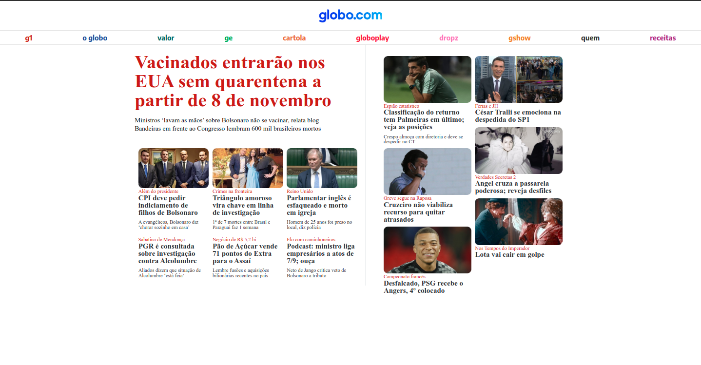

## Projeto-Globo.com

Layout responsivo de uma versão simplificada da home da Globo.com, utilizando HTML e CSS. Objetivo era treinar os aprendizados em HTML e css. 

### Link da vercel https://projeto-globo-com.vercel.app/

